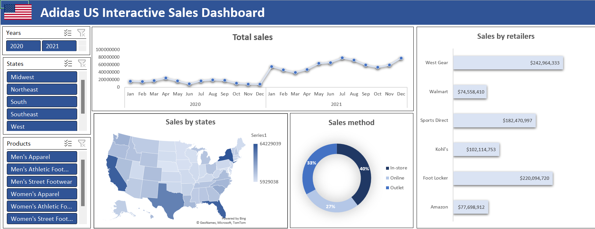
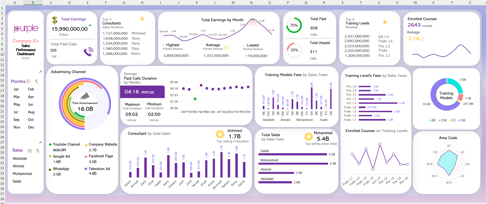
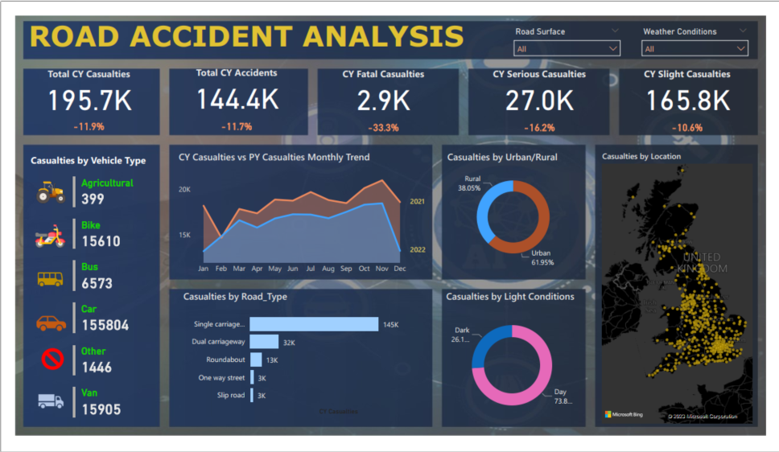

# ONLINE RETAIL SALES ANALYSIS (MICROSOFT EXCEL)

**Title:** [Online Retail Sales Analysis](https://github.com/MowillsN/WilliamsN.github.io/blob/main/sales_analysis_dashboard.xlsx)

**Tools Used:** Advanced Microsoft Excel (Pivot Tables, Pivot Charts, Slicers, Conditional formating)

**Project Description:**

This project focuses on analyzing a large dataset containing over 100,000 records of customer transactions across multiple years, countries, and product categories. The dataset includes detailed information about customer demographics, purchase behavior, and product performance, offering an opportunity to generate actionable insights for improving business strategies.

**KEY FINDINGS:**
- The total revenue generated by the company is £96,176,318

- Adults aged 35 - 64 account for 50% of the revenue genrated by the company

- The most sold products in this online retail service are the bikes

- The majority of the revenue generated by this company comes from the united states

**Dashboard Overview:**

# Adidas SALES ANALYSIS (MICROSOFT EXCEL)

**Title:** [Adidas Sales Analysis](https://github.com/MowillsN/WilliamsN.github.io/blob/main/Adidas%20Sales%20Analysis%20Dashboard.xlsx)

**Tools Used:** Advanced Microsoft Excel (Pivot Tables, Pivot Charts, Slicers, Conditional formating)

**Project Description:**

This project focuses on analyzing a dataset related to Adidas sales, customer demographics, and product performance to uncover actionable insights that can inform business strategies. By analyzing historical sales data, customer behavior, and inventory performance, the project aims to help Adidas (or a similar retailer) optimize product offerings, pricing strategies, and customer engagement

**Key findings:**

- Of all the retailers, West Gear generated the most sales with a total sale of $242,964,333
  
- Most of the sales occur in-store, compared to online and outlets.
  
- New York generated the most sales.
  
- Adidas experienced a major increase in sales in 2021 compared to 2020

**Dashboard Overview:**

# Sales Performance ANALYSIS (MICROSOFT EXCEL)

**Title:** [Sales Performance Analysis](https://github.com/MowillsN/WilliamsN.github.io/blob/main/Sales%20Performance%20Dashboard.xlsx)

**Tools Used:** Advanced Microsoft Excel (Pivot Tables, Pivot Charts, Slicers, Conditional formating)

**Project Description:**

This project analyzes the sales performance of a telecom company, driving valuable insights into various aspects of the business

**KEY FINDINGS:**
- The total revenue generated by the company is $15.9B

- The Top selling consultant is Mohammed with a total sales of $5.4B

- The average paid call duration is 04 mins:15s

- The company generated 4.6B in Tv ads

**Dashboard Overview:**

# Workplace Safety Analysis (SQL)

**Title:** WorkplaceSafetyAnalysis

**SQL Code:**[WorkplaceSafetyAnalysis](https://github.com/MowillsN/WilliamsN.github.io/blob/main/WorkplaceSafetyAnalysis.sql)

**SQL Skills Used:** 

*Aggregation Functions:* COUNT(), SUM(), AVG(), MAX(): Used to calculate counts, sums, averages, and maximum values for various columns like incidents, costs, and days lost.

*Grouping Data:* GROUP BY: Groups data by specific columns (e.g., department, plant) to allow aggregation.

*Filtering Data:*

WHERE: Filters data before aggregation, e.g., to focus on specific incident types or report types.

HAVING: Filters data after grouping, e.g., to find departments with incidents lasting more than two days.

*Window Functions:* ROW_NUMBER(): Assigns a unique number to rows based on specified ordering, used for ranking incidents or reports.

*Date and Time Functions:* YEAR(), MONTH(), FORMAT(): Extracts and formats date values for grouping incidents by year, month, or shift.

*Subqueries and Common Table Expressions (CTEs):*

WITH clause: Used to create reusable query blocks (CTEs) for ranking or filtering data (e.g., ranking departments by incident counts).

*Sorting Data:* ORDER BY: Sorts results by specified columns in ascending or descending order.

**Project Description:**

This project involves analyzing workplace safety data to identify patterns and trends related to incidents, costs, and the impact on employees. Using SQL queries to explore a comprehensive dataset, the goal is to provide actionable insights into the frequency and severity of incidents, their associated costs, and the factors influencing safety in the workplace. The analysis covers various aspects, such as incident types, departments, shifts, age groups, plants, and costs, with a focus on identifying high-risk areas and opportunities for improvement

**Technology used:** SQL server

# Movie Rental Service Analysis (SQL)

**Title:** Movie_Rental_Service_Analysis

**SQL Code:**[Movie_Rental_Service_Analysis](https://github.com/MowillsN/WilliamsN.github.io/blob/main/Movie_Rental_Service_Analysis.sql)

**SQL Skills Used:** 

*SELECT & Filtering:*

  SELECT for querying specific columns.

  WHERE and HAVING for filtering data based on conditions.

*Aggregation Functions:*

  COUNT(), SUM(), MAX(), MIN() for counting, summing, and finding the maximum or minimum values.

*Grouping Data:* GROUP BY to group data by columns for aggregation.

*Joins:* INNER JOIN and LEFT JOIN for combining data from multiple tables.

*Date Functions:* LEFT() and DATE_FORMAT() for extracting date parts like year and month.

*Subqueries and Temporary Tables:* Using subqueries and CREATE TEMPORARY TABLE for intermediate results and complex filtering.

*Advanced Reporting:* COUNT(DISTINCT) for counting unique values, and using shorthand like GROUP BY 1 for simplicity.

**Project Description:**

This project involves analyzing a movie rental service's database to uncover key insights and trends related to customer behavior, movie rentals, revenue generation, and store performance. The database includes tables for customers, films, rentals, stores, and payments, among others. The goal is to provide valuable business insights that can guide marketing campaigns, customer rewards programs, and overall business strategy.

**Technology used:** SQL server

# Hospital patients Analysis (SQL)

**Title:** Hospital_Patients_Analysis

**SQL Code:**[Hospital_Patients_Analysis](https://github.com/MowillsN/WilliamsN.github.io/blob/main/Heathcare_Analysis.sql)

**SQL Skills Used:** 

*Basic Queries:* Retrieving and counting data (e.g., using SELECT, COUNT, SUM, AVG).

*Grouping & Aggregation:* Grouping data by columns (GROUP BY) and filtering groups (HAVING).

*Window Functions:* Ranking and partitioning data (DENSE_RANK(), SUM() OVER).

*Joins & Subqueries:* Combining and embedding queries for detailed data retrieval (INNER JOIN, subqueries).

*Date Functions:* Calculating differences between dates (DATEDIFF).

*Stored Procedures:* Creating reusable procedures for tasks like matching blood donors.

*Conditional Logic:* Using CASE statements to categorize data.

**Project Description:**

This project involves performing a comprehensive analysis of a healthcare database, aimed at understanding patient demographics, medical conditions, treatment patterns, and financial aspects associated with healthcare services. The queries are designed to extract insights from a dataset containing patient records, including their medical conditions, hospital visits, treatments, billing amounts, insurance providers, and more.

**Technology used:** SQL server

# E-COMMERCE SALES ANALYSIS (POWER BI)

**Title:** [E-COMMERCE SALES ANALYSIS](https://github.com/MowillsN/WilliamsN.github.io/blob/main/Ecommerce_Sales_Insights.pbix)

**Tools Used:** Power BI,Power Query, Dax

**Project Description:**

This project provides a detailed analysis of an e-commerce business using Power BI tools. Key business metrics and trends are showcased through an interactive dashboard, enabling data-driven decision-making to drive growth. The project also includes forecasting methods for predictive analysis.

**KEY FINDINGS:**
- Key Performance Indicators (KPIs): Total Profit, Total Sales, Total Quantity, Profit Margin%

- Monthly Trends: Sales and Profit Insights

- Category Breakdown: Profits, Sales, and Sales Percentage

- Geographic Sales Analysis: States and Regions

- Top 5 & Bottom 5 Products Analysis

- Regional Sales Performance Analysis

# UK ROAD ACCIDENT ANALYSIS (POWER BI)

**Title:** [UK ROAD ACCIDENT ANALYSIS](https://github.com/MowillsN/WilliamsN.github.io/blob/main/Road%20Accidents%20Dashboard.pbix)

**Tools Used:** Power BI,Power Query, Dax

**Project Description:**

This project involves analyzing road accidents across the UK using Power BI to identify key trends, patterns, and insights. By visualizing accident data through interactive dashboards, the project highlights critical factors such as accident frequency, locations, causes, and severity. Key metrics such as accident types, time of occurrence, and weather conditions are explored to uncover patterns and inform road safety strategies. The analysis also incorporates geographic and temporal trends, providing a deeper understanding of high-risk areas and times. Ultimately, the project aims to support data-driven decision-making for improving road safety and reducing accidents across the UK.

**KEY FINDINGS:**
- Primary KPIs: Total Casualties and Total Accidents for the Current Year, along with Year-over-Year (YoY) Growth  
- Primary KPIs: Total Casualties by Accident Severity for the Current Year, with YoY Growth  
- Secondary KPIs: Total Casualties by Vehicle Type for the Current Year  
- Monthly Trend: Casualties Comparison between the Current Year and Previous Year  
- Casualties by Road Type for the Current Year  
- Casualties by Area/Location and Day/Night for the Current Year  
- Total Casualties and Total Accidents by Location

**Dashboard Overview:**

